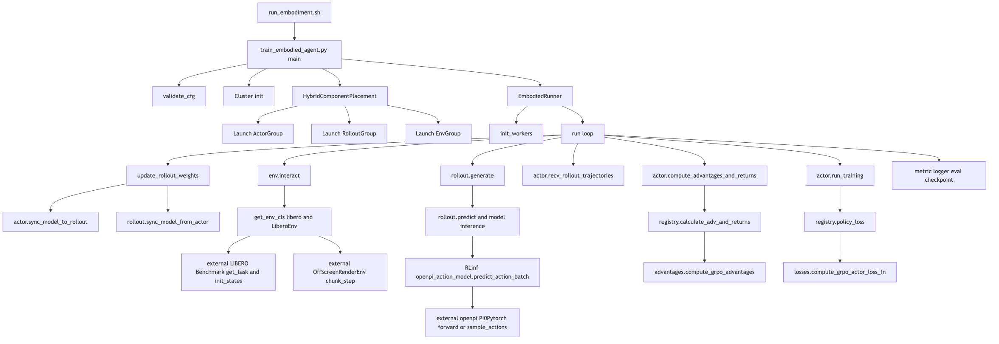

# RLinf 单机架构（libero_10_grpo_openpi_pi05）

本文档记录以下运行配置对应的核心运行架构：

- 入口命令：`examples/embodiment/run_embodiment.sh libero_10_grpo_openpi_pi05`
- 范围：仅单机路径
- 重点：核心调用关系与模块职责
- 说明：本文故意不展开算法公式

## 1. 分层主流程

### 1.1 启动层

1. `run_embodiment.sh` 设置环境变量并启动 Python 入口。
2. `train_embodied_agent.py` 读取 Hydra 配置并执行配置校验。
3. 本次使用配置：`examples/embodiment/config/libero_10_grpo_openpi_pi05.yaml`。

关键文件：

- `examples/embodiment/run_embodiment.sh`
- `examples/embodiment/train_embodied_agent.py`
- `examples/embodiment/config/libero_10_grpo_openpi_pi05.yaml`

### 1.2 调度层

1. `validate_cfg` 校验 runner/algorithm/model/env 约束。
2. `Cluster` 初始化（或连接）Ray 运行时。
3. `HybridComponentPlacement` 解析组件放置和 world size。
4. 通过 `create_group(...).launch(...)` 启动：
   - actor 组（本配置为 `EmbodiedFSDPActor`）
   - rollout 组（`MultiStepRolloutWorker`）
   - env 组（`EnvWorker`）

关键文件：

- `rlinf/config.py`
- `rlinf/scheduler/cluster/cluster.py`
- `rlinf/scheduler/placement/placement.py`
- `rlinf/scheduler/worker/worker.py`
- `rlinf/scheduler/worker/worker_group.py`

### 1.3 执行层

1. `EmbodiedRunner` 创建 3 条通道（`Env`、`Rollout`、`Actor`）。
2. Runner 按顺序初始化 workers（`actor -> rollout -> env`）。
3. 运行时数据流：
   - env 通过 channel 把观测送给 rollout；
   - rollout 把动作发回 env，并把轨迹送给 actor；
   - actor 更新参数并把权重同步给 rollout。

关键文件：

- `rlinf/runners/embodied_runner.py`
- `rlinf/scheduler/channel/channel.py`
- `rlinf/workers/env/env_worker.py`
- `rlinf/workers/rollout/hf/huggingface_worker.py`
- `rlinf/workers/actor/fsdp_actor_worker.py`

### 1.4 训练循环层

`EmbodiedRunner.run()` 每一步执行：

1. `sync_weights`：
   - `actor.sync_model_to_rollout()`
   - `rollout.sync_model_from_actor()`
2. `generate_rollouts`：
   - `env.interact(...)`
   - `rollout.generate(...)`
   - `actor.recv_rollout_trajectories(...)`
3. `cal_adv_and_returns`：
   - `actor.compute_advantages_and_returns()`
4. `actor training`：
   - `actor.run_training()`
5. 按配置执行日志/评估/保存 checkpoint。

算法分发路径：

- advantage：`rlinf/algorithms/registry.py -> advantages.py`
- loss：`rlinf/algorithms/registry.py -> losses.py`

## 2. 核心抽象

1. `Cluster`：Ray 集群生命周期与调度 manager actors 管理。
2. `ComponentPlacement`/`HybridComponentPlacement`：组件到资源的映射与 world size 计算。
3. `Worker`：远程执行抽象，提供 send/recv/broadcast 通信能力。
4. `WorkerGroup`：同类 worker 的批量启动与组调用封装。
5. `Channel`：支持 key 路由的队列式跨 worker 通信。
6. `EmbodiedRunner`：编排 embodied RL 的完整控制循环。
7. `EnvWorker`：管理环境实例并执行环境交互。
8. `MultiStepRolloutWorker`：执行策略推理并构建 rollout 轨迹。
9. `EmbodiedFSDPActor`：消费轨迹、计算优势与损失、更新模型、同步权重。
10. `OpenPi0ForRLActionPrediction`：RLinf 中 OpenPI 的 VLA 包装器（actor/rollout 复用）。
11. `LiberoEnv`：RLinf 对 LIBERO 任务与向量化步进的封装。

## 3. 关键调用图



该图唯一维护源文件：

- `diagrams/single_node_key_call_graph.mmd`

修改图后重渲染命令：

```bash
mmdc -i diagrams/single_node_key_call_graph.mmd \
  -o diagrams/single_node_key_call_graph.png \
  -e png \
  -s 3
```

## 4. RL 与 VLA 源码位置

### 4.1 RL（RLinf 内部）

- 算法分发：
  - `rlinf/algorithms/registry.py`
- 优势函数：
  - `rlinf/algorithms/advantages.py`
- 损失函数：
  - `rlinf/algorithms/losses.py`
- actor 调用点：
  - `rlinf/workers/actor/fsdp_actor_worker.py`

### 4.2 VLA（RLinf OpenPI 包装层）

- 模型工厂：
  - `rlinf/models/__init__.py`
- OpenPI 模型构造：
  - `rlinf/models/embodiment/openpi/__init__.py`
- OpenPI RL 动作模型：
  - `rlinf/models/embodiment/openpi/openpi_action_model.py`
- OpenPI 数据/模型变换配置：
  - `rlinf/models/embodiment/openpi/dataconfig/__init__.py`
  - `rlinf/models/embodiment/openpi/dataconfig/libero_dataconfig.py`
  - `rlinf/models/embodiment/openpi/policies/libero_policy.py`

### 4.3 外部依赖展开

#### openpi（external_deps/openpi）

- `src/openpi/models_pytorch/pi0_pytorch.py`
- `src/openpi/models/model.py`
- `src/openpi/models/pi0_config.py`
- `src/openpi/models_pytorch/preprocessing_pytorch.py`
- `src/openpi/transforms.py`
- `src/openpi/training/checkpoints.py`
- `src/openpi/shared/download.py`

#### LIBERO（external_deps/LIBERO）

- `libero/libero/__init__.py`
- `libero/libero/benchmark/__init__.py`
- `libero/libero/benchmark/libero_suite_task_map.py`
- `libero/libero/envs/__init__.py`
- `libero/libero/envs/env_wrapper.py`

## 5. 最小阅读路径（快速上手）

1. 入口与配置：
   - `examples/embodiment/run_embodiment.sh`
   - `examples/embodiment/train_embodied_agent.py`
   - `examples/embodiment/config/libero_10_grpo_openpi_pi05.yaml`
2. Runner 主循环：
   - `rlinf/runners/embodied_runner.py`
3. 三类 worker：
   - `rlinf/workers/env/env_worker.py`
   - `rlinf/workers/rollout/hf/huggingface_worker.py`
   - `rlinf/workers/actor/fsdp_actor_worker.py`
4. 算法分发与实现：
   - `rlinf/algorithms/registry.py`
   - `rlinf/algorithms/advantages.py`
   - `rlinf/algorithms/losses.py`
5. VLA 路径：
   - `rlinf/models/embodiment/openpi/openpi_action_model.py`
   - `external_deps/openpi/src/openpi/models_pytorch/pi0_pytorch.py`
6. 外部环境路径：
   - `rlinf/envs/libero/libero_env.py`
   - `external_deps/LIBERO/libero/libero/benchmark/__init__.py`
   - `external_deps/LIBERO/libero/libero/envs/env_wrapper.py`

## 6. 不确定性标注

1. actor/env/rollout 的 world size 来自 placement 与当前硬件推断，未在本地运行时验证。
2. 真实训练环境所使用的 external dependency commit，若要求严格可复现，需要单独确认。
3. offload/cuda graph/eval 频率等分支取决于配置开关；本文按 `libero_10_grpo_openpi_pi05.yaml` 主路径描述。

## 7. 10 分钟阅读清单

1. 确认入口与配置绑定：
   - `examples/embodiment/run_embodiment.sh`
   - `examples/embodiment/train_embodied_agent.py`
   - `examples/embodiment/config/libero_10_grpo_openpi_pi05.yaml`
2. 看主循环骨架：
   - `rlinf/runners/embodied_runner.py`
   - 重点：`init_workers`、`run`、`update_rollout_weights`、`evaluate`
3. 看 env 侧数据流：
   - `rlinf/workers/env/env_worker.py`
   - 重点：`init_worker`、`interact`、`env_interact_step`、`send_env_batch`
4. 看 rollout 侧数据流：
   - `rlinf/workers/rollout/hf/huggingface_worker.py`
   - 重点：`init_worker`、`generate`、`generate_one_epoch`、`predict`、`send_rollout_trajectories`
5. 看 actor 侧训练流：
   - `rlinf/workers/actor/fsdp_actor_worker.py`
   - 重点：`recv_rollout_trajectories`、`compute_advantages_and_returns`、`run_training`、`sync_model_to_rollout`
6. 看算法分发：
   - `rlinf/algorithms/registry.py`
   - 重点：`calculate_adv_and_returns`、`policy_loss`
7. 看本配置涉及的算法实现：
   - `rlinf/algorithms/advantages.py`
   - 重点：`compute_grpo_advantages`
   - `rlinf/algorithms/losses.py`
   - 重点：`compute_grpo_actor_loss_fn`、`compute_ppo_actor_loss`
8. 看 RLinf 的 OpenPI 包装层：
   - `rlinf/models/embodiment/openpi/openpi_action_model.py`
   - 重点：`predict_action_batch`、`default_forward`、`get_log_prob_value`
9. 看 external OpenPI 核心：
   - `external_deps/openpi/src/openpi/models_pytorch/pi0_pytorch.py`
   - 重点：`sample_actions`、`forward`、`embed_prefix`、`embed_suffix`
10. 看 external LIBERO 任务/环境核心：
    - `external_deps/LIBERO/libero/libero/benchmark/__init__.py`
    - 重点：`Benchmark`、`get_task`、`get_task_init_states`
    - `external_deps/LIBERO/libero/libero/envs/env_wrapper.py`
    - 重点：`ControlEnv`、`OffScreenRenderEnv`
