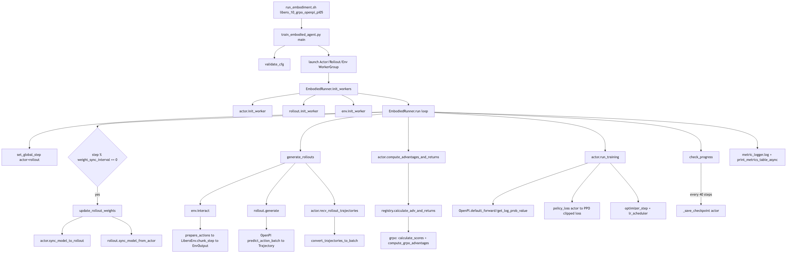

# `runner.run()` 调用展开（`libero_10_grpo_openpi_pi05`）

本文对应运行命令：

```bash
bash examples/embodiment/run_embodiment.sh libero_10_grpo_openpi_pi05
```

目标：从 `train_embodied_agent.py` 进入 `runner.run()`，展开主路径调用，说明每一步做了什么、数据如何流动。

## 1. 入口与配置绑定

- 入口脚本：`examples/embodiment/run_embodiment.sh`
  - 设置 `MUJOCO_GL=egl`、`PYOPENGL_PLATFORM=egl`、`ROBOT_PLATFORM`、`PYTHONPATH`。
  - 最终执行：
    `python examples/embodiment/train_embodied_agent.py --config-path ... --config-name libero_10_grpo_openpi_pi05 runner.logger.log_path=...`
- Python 入口：`examples/embodiment/train_embodied_agent.py`
  - `validate_cfg(cfg)`
  - 创建 `Cluster` + `HybridComponentPlacement`
  - 启动 3 组 worker：`ActorGroup`、`RolloutGroup`、`EnvGroup`
  - `runner = EmbodiedRunner(...)`
  - 顺序执行：
    1. `runner.init_workers()`
    2. `runner.run()`

本配置关键点（`examples/embodiment/config/libero_10_grpo_openpi_pi05.yaml`）：

- `algorithm.loss_type: actor` -> Actor 类是 `EmbodiedFSDPActor`
- `algorithm.adv_type: grpo`
- `runner.val_check_interval: -1`（训练时不做 eval）
- `runner.save_interval: 40`
- `env.train.max_steps_per_rollout_epoch: 480`
- `actor.model.num_action_chunks: 10`
- `algorithm.rollout_epoch: 8`

## 2. `run()` 每一步做什么

代码：`rlinf/runners/embodied_runner.py::EmbodiedRunner.run`

每个 step 的顺序如下：

1. **设置 step**
   - `actor.set_global_step(self.global_step)`
   - `rollout.set_global_step(self.global_step)`

2. **同步权重（按 interval）**
   - 条件：`_step % weight_sync_interval == 0`（默认被 `validate_cfg` 设为 1）
   - `update_rollout_weights()`
     - `rollout.sync_model_from_actor()`
     - `actor.sync_model_to_rollout()`

3. **生成 rollout**
   - `env.interact(input_channel=Rollout, output_channel=Env)`
   - `rollout.generate(input_channel=Env, output_channel=Rollout, actor_channel=Actor)`
   - `actor.recv_rollout_trajectories(input_channel=Actor).wait()`
   - `rollout_handle.wait()`

4. **计算优势**
   - `actor.compute_advantages_and_returns().wait()`
   - 本配置走 `adv_type=grpo`

5. **训练 actor**
   - `actor_training_handle = actor.run_training()`
   - `actor_training_metrics = actor_training_handle.wait()`

6. **进度控制**
   - `check_progress(...)` 决定 `run_val` / `save_model`
   - 本配置 `val_check_interval=-1`，训练期间 `run_val=False`
   - 每 40 step 保存一次：`_save_checkpoint()`

7. **记录指标**
   - 聚合 `time/env/rollout/train` 指标
   - `metric_logger.log(...)`
   - `print_metrics_table_async(...)` 异步打印

8. **结束处理**
   - `metric_logger.finish()`
   - 停止日志线程

## 3. 三条核心调用链

### 3.1 Env 链：`env.interact`

代码：`rlinf/workers/env/env_worker.py`

主路径：

1. `interact()` 先把初始 `EnvOutput` 发给 rollout
2. 循环 `n_chunk_steps = 480 // 10 = 48`：
   - 从 `Rollout` channel 收动作 `recv_chunk_actions`
   - `env_interact_step(raw_chunk_actions, stage_id)`：
     - `prepare_actions(...)`（`libero` 分支）
     - `LiberoEnv.chunk_step(chunk_actions)`
     - 得到 `obs/rewards/dones/terminations/truncations/final_obs`
   - `send_env_batch(...)` 把环境输出发回 rollout
3. 汇总 env 指标并返回

`LiberoEnv.chunk_step()`（`rlinf/envs/libero/libero_env.py`）会：

- 对 chunk 内每个动作调用 `step(auto_reset=False)`
- 聚合 chunk 奖励与 done
- 必要时 `_handle_auto_reset(...)`
- 返回 `(obs_list, chunk_rewards, chunk_terminations, chunk_truncations, infos_list)`

### 3.2 Rollout 链：`rollout.generate`

代码：`rlinf/workers/rollout/hf/huggingface_worker.py`

主路径：

1. 构建 `self.rollout_results`（每 stage 一个 `EmbodiedRolloutResult`）
2. 循环 `rollout_epoch=8`，每轮执行 `generate_one_epoch(...)`
3. `generate_one_epoch` 中每个 chunk step：
   - `recv_env_output(...)` 收 env obs
   - `predict(env_obs)` -> `hf_model.predict_action_batch(...)`
   - 记录 `ChunkStepResult`（`prev_logprobs/prev_values/rewards/dones/forward_inputs`）
   - `send_chunk_actions(...)` 把动作发给 env
4. 每个 stage 调用 `send_rollout_trajectories(...)`
   - `EmbodiedRolloutResult.to_splited_trajectories(split_num)`
   - 向 actor channel 发送 `Trajectory`

模型路径（本配置 `openpi`）：

- `predict_action_batch`：
  - obs 预处理 + transform
  - `sample_actions(...)` 采样动作并返回 `chains/denoise_inds/prev_logprobs/prev_values`
  - 组织 `forward_inputs`

### 3.3 Actor 链：收轨迹 -> Adv -> Train

代码：`rlinf/workers/actor/fsdp_actor_worker.py`

1. `recv_rollout_trajectories(...)`
   - 按 `split_num` 从 channel 收多个 `Trajectory`
   - `convert_trajectories_to_batch(...)`
   - `_process_received_rollout_batch(...)`
     - reshape 为训练格式
     - 可选 `compute_loss_mask(...)`
     - 可选 reward filter（本配置启用）

2. `compute_advantages_and_returns()`
   - 调 `calculate_adv_and_returns(...)`（registry 分发）
   - embodied 预处理：`preprocess_embodied_advantages_inputs`
   - `adv_type=grpo` 时先 `calculate_scores` 再 `compute_grpo_advantages`
   - 更新 `self.rollout_batch["advantages"]`
   - `compute_rollout_metrics(...)`

3. `run_training()`
   - 载入 offload 参数（如果启用）
   - 打乱 batch，按 `global_batch/micro_batch` 分块
   - 每个 micro batch：
     - `self.model(...)`（OpenPI 走 `default_forward` -> `get_log_prob_value`）
     - `policy_loss(loss_type="actor")`
       -> `compute_grpo_actor_loss_fn`
       -> `compute_ppo_actor_loss`
     - backward + grad accumulation
   - `optimizer_step()`、`lr_scheduler.step()`、all_reduce 指标
   - 返回训练指标字典

## 4. `runner.run()` 调用图（主路径）



图源文件（可编辑）：

- `diagrams/runner_run_expansion_libero10_grpo_openpi_pi05.mmd`

渲染命令：

```bash
mmdc -i diagrams/runner_run_expansion_libero10_grpo_openpi_pi05.mmd \
  -o diagrams/runner_run_expansion_libero10_grpo_openpi_pi05.png \
  -e png \
  -s 3
```

## 5. 后续提问建议（按收益排序）

1. `rollout.generate_one_epoch`：每个张量 shape 如何演化  
2. `actor.recv_rollout_trajectories`：`split_num` 与 batch 拼接逻辑  
3. `compute_advantages_and_returns`：`grpo` 下 `scores/advantages` 的具体构造  
4. `run_training`：`global_batch / micro_batch / gradient_accumulation` 的关系  
5. `OpenPI.default_forward`：`chains + denoise_inds` 到 `logprobs` 的细节  
